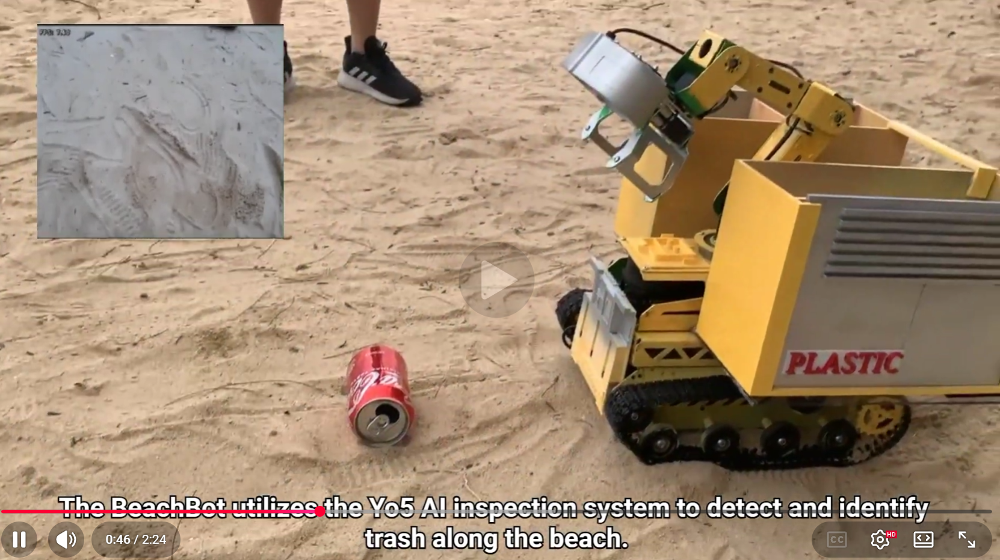
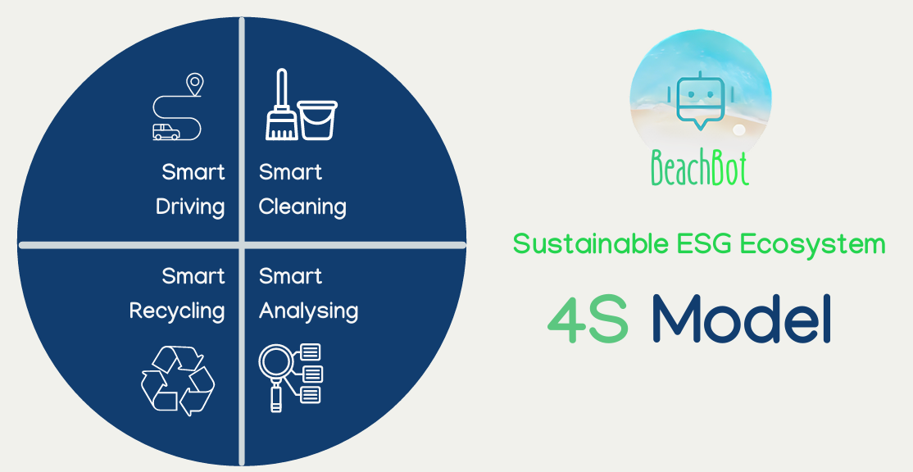
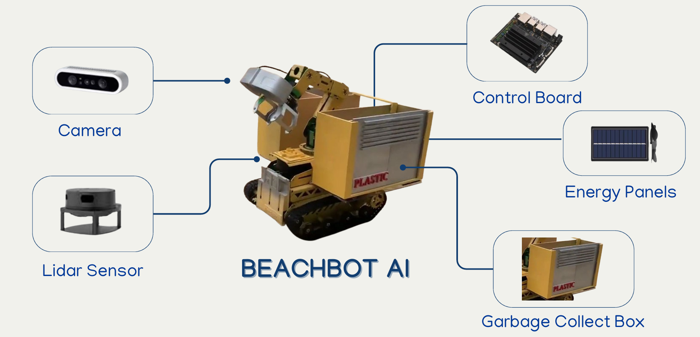
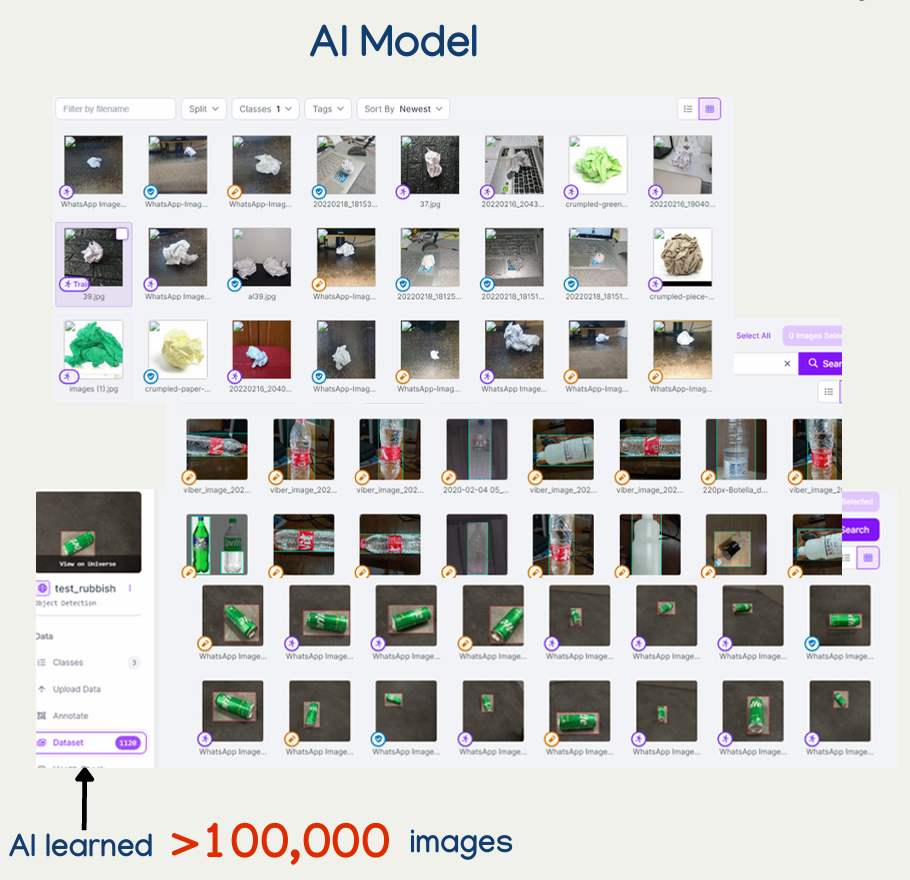
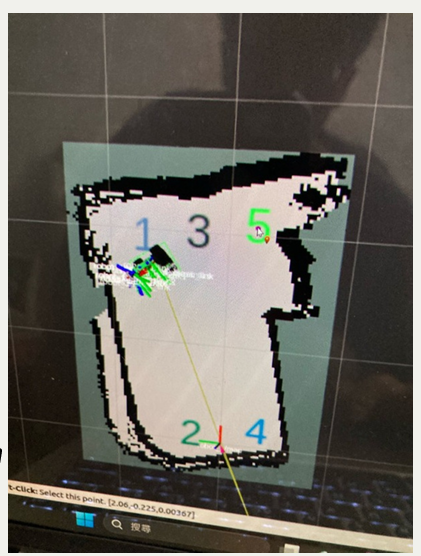
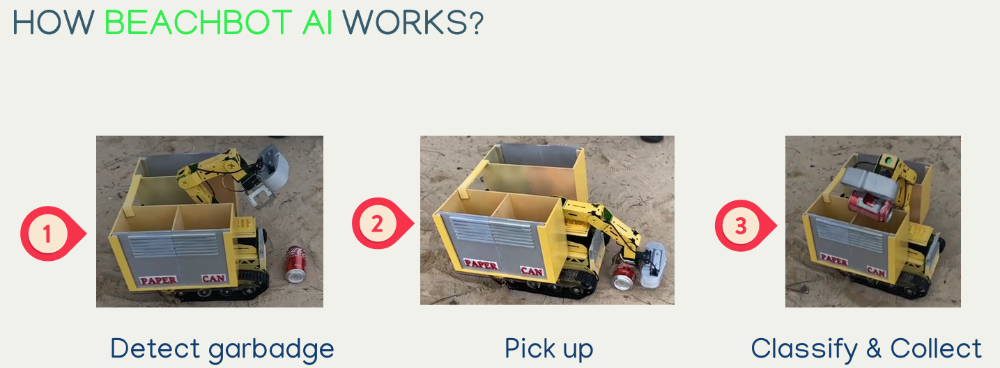
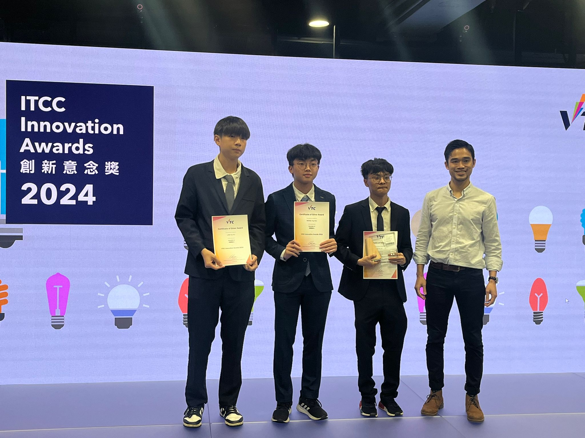
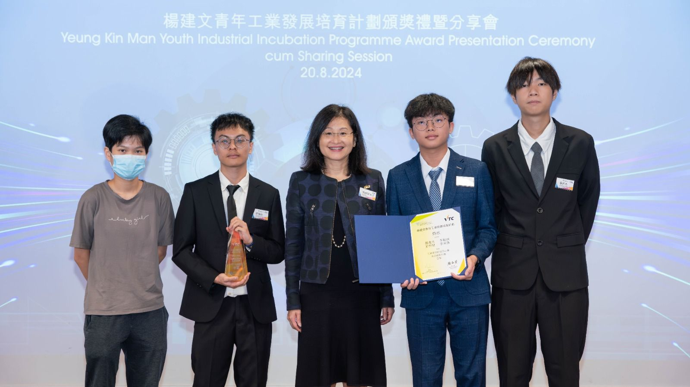
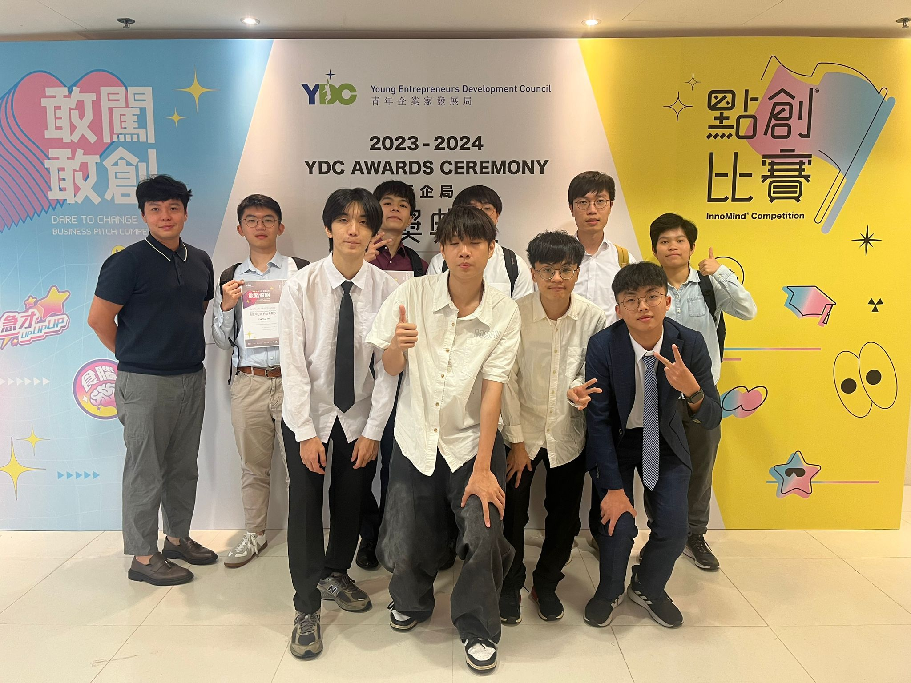
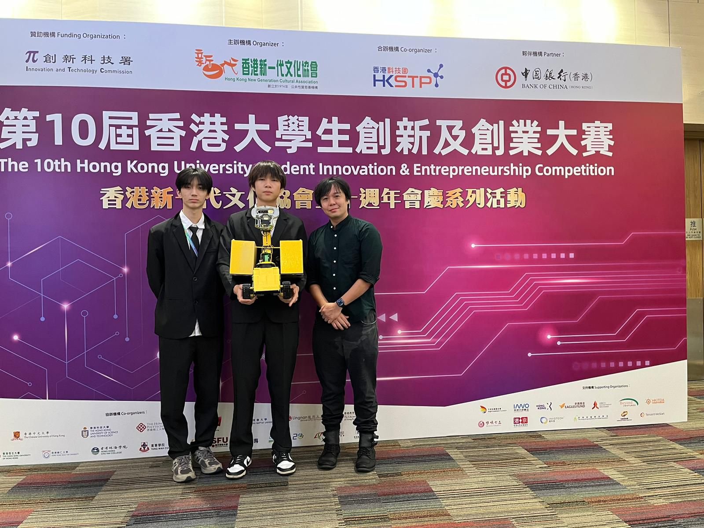

# BeachBot AI – Smart Beach Cleaning Robot

## Project Overview

BeachBot AI is an autonomous robot designed to improve beach cleaning efficiency.  
The goal is to reduce manpower, operational cost, and environmental pollution through automation.

This project was developed for a robotics competition and focuses on applying AI and system design to a real-world problem.

---

## Demo Video

 

---

---

## Problem

Beach environments face several challenges:

- Large amount of waste accumulation  
- High manpower and operational costs  
- Poor user experience due to pollution  

---

## Solution

BeachBot AI provides an automated cleaning system with:
- Garbage detection using AI  
- Autonomous navigation using LiDAR  
- Waste collection and classification  
- Support for renewable energy  

---

## System Overview

Architecture (Hardware):
The system consists of:

- Camera for object detection  

- LiDAR sensor for mapping and obstacle avoidance  

- Control board for navigation  
- Garbage collection mechanism  

---

## How It Works

1. Detect waste using AI  
2. Navigate the environment autonomously  
3. Collect and sort garbage  

---

## Results
- Reduced cleaning time  
- Reduced manpower requirement  
- Lower operational cost  
---

## Report
./docs/Beachbot.pdf  

---

## My Contributions

- Participated in system design and development  
- Worked on hardware/software integration  
- Assisted in testing and implementation  
- Contributed to project presentation  

---

## Key Learning

- Application of AI concepts in robotics  
- System integration between hardware and software  
- Problem-solving in real-world scenarios  
- Team collaboration in engineering projects  

## Achievement

  </b>
- Award: Silver
- Competition: ITCC Innovation Awards 2024

  </b>
- Award: Silver
- Competition: Industrial Project Competition 

  </b>
- Award: Certificate
- Competition: YDC Dare to Change Business Pitch

  </b>
- Award: Certificate
- Competition: Hong Kong University Student Innovation & Entrepreneurship 

